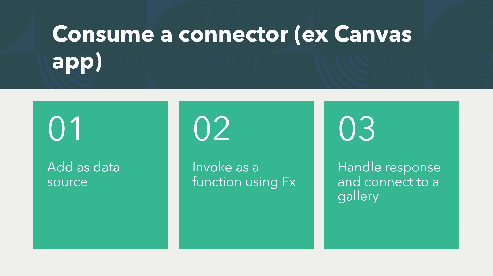
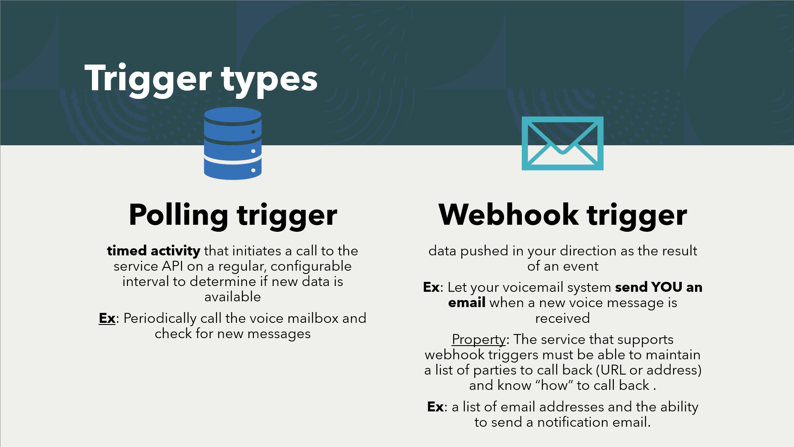
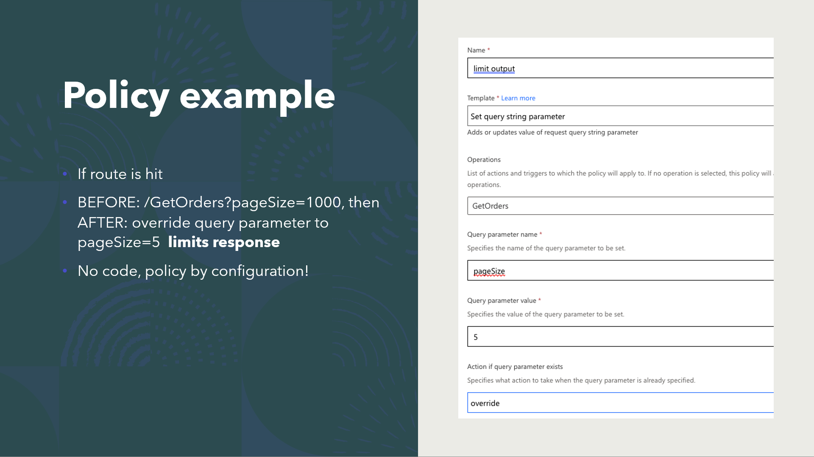

<head>
  <meta name="twitter:url" content="https://microsoft.github.io/30daysof/docs/roadmaps/fusion" />
  <meta name="twitter:title" content="30DaysOfFusion Kick-Off" />
  <meta name="twitter:description" content="Join us for #30DaysOfLearning initiatives that take you from fundamental concepts to functional code to cloud deployment!" />
  <meta name="twitter:image" content="https://microsoft.github.io/30daysof/assets/images/fusion-f731f3ccac8a8ee153416f249d058b46.png" />
  <meta name="twitter:card" content="summary_large_image" />
  <meta name="twitter:creator" content="@nitya" />
  <meta name="twitter:site" content="@AzureAdvocates" /> 
  <link rel="canonical" href="https://aka.ms/TheConnectorHackathon" />
</head>

## Hello Day 5! 

Check out what we tackle today. But before that, here is what you have done so far _(You can catch up with the others if you are a step behind ...)_

1. Joined the [Cloud Skills Challenge](https://aka.ms/ConnectorSkillsChallenge)
1. Created a [M365 & Power Apps Developer Account](https://techcommunity.microsoft.com/t5/educator-developer-blog/recap-of-day-2-onboarding-session-30days-of-learning-nigeria/ba-p/3490280?WT.mc_id=academic-0000-juliamuiruri)
1. Signed in to https://make.powerautomate.com/ or https://make.powerapps.com/ and attempted your first connector. [See how to start on the SWAPI connector here](https://youtu.be/CMCuNYVW4B0)
1. Talked to us on our [Discussion Forum](https://github.com/microsoft/30daysof/discussions/16) 😇

## Day 5: Summary

Today, we have covered building the SWAPI connector from scratch with an introduction to Triggers and Policies, consuming it directly from a Power App and learnt how to build a custom connector from an OpenAPI specification file.

Suppose you want to build your first connector, what are your options?
1. _[Recommended]_ We have hundreds of existing services/ APIs that are inaccessible from the power platform today. You may decide to look through the [list of existing connectors](https://learn.microsoft.com/en-us/connectors/connector-reference/?WT.mc_id=academic-73999-juliamuiruri), identify a service with a Public API that is missing a connector and decide to build it for this hackathon. For inspiration on which connector you can build, see a list of the [Top Connector Asks Today](https://github.com/microsoft/PowerPlatformConnectors/wiki/Top-Connector-Asks?WT.mc_id=academic-73999-juliamuiruri)

    #### Steps
    A) Identify the Public API, describing available endpoints (/users), operations (GET/users) and operation parameters inputs & outputs

    B) Obtain the OpenAPI spec file or Postman collection. APIs like the [Daraja API](https://developer.safaricom.co.ke/APIs) have the Postman collections ready for you.
    

    C) Use it to create a connector
1. Create your own API, publish it, then create a connector for it.

    #### Steps
    A) Write your own API

    b) Generate an OpenAPI Spec file. (The  connector creation wizard currently supports only v2.0 spec files) 
    
    - If you are working in python, you can use the [FastAPI framework](https://fastapi.tiangolo.com/tutorial/?WT.mc_id=academic-73999-juliamuiruri) which will document the API for you

    - If JavaScript, you can use [Nestjs Framework](https://docs.nestjs.com/openapi/introduction) for your API definition
    

### What next after creating a connector?

### Actions, Triggers & Policy Templates
An **Action** is what your connector can do. For example, the SWAPI Connector that we created today has an action called 'GetPeople' that returns Star Wars characters and properties like: height, mass, hair color etc. from the API 

A **Trigger** is an event/ a condition that when met, causes the system to do something or respond to changes in the underlying data/service. For example, using the [Outlook.com](https://learn.microsoft.com/en-us/connectors/outlook/?WT.mc_id=academic-73999-juliamuiruri) connector, you can define steps to be takes automatically when a new email arrives in your inbox, and in this case, the **when a new email arrives** is a trigger for the outlook.com connector 

There are 2 Types of Triggers:

A **Policy** is added while creating a connector to modify its behaviour at runtime. For example, if the API you are working with has a limited number of API calls, you can set throttling limits using a Policy

### Next Steps
Head over to https://make.powerautomate.com/ and start today!

Explore resources shared on the [presentation deck](https://github.com/microsoft/30daysof/discussions/16#discussioncomment-3678667)

Build your first connector, share on Social media and tag us to celebrate your learning!

:::success READY? LET'S GO! 🎉
Day 8 (Monday) >> Join us today at 6PM EAT, to meet an Independent Publisher who will share his experience of building and submitting a connector!

Day 11 (Thursday) >> Join us for a session on validating your connector before submitting it to GitHub
:::